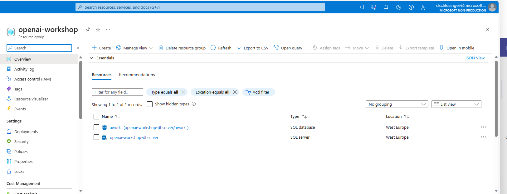

For this workshop you MUST have the following:

## Requirements
- VsCode
- Python 3.10
- A virtual environment tool (venv)
- An Azure account 
- An active Azure OpenAI account with 2 deployed models see below

## Preparation

### OpenAI subscription and deployments. If you already have an Azure OpenAI account with the following deployments you can skip this step.
* Create an Azure OpenAI account
* Create 'gpt-35-turbo',  gpt-35-turbo-instruct, 'text-embedding-ada-002' deployments


### Clone workshop repository
 - create a folder in your local machine called azure-openai
 - cd into the folder
 - run the following command:
    ```
    git clone https://github.com/vladfeigin/openaiworkshop.git 
    ```
- cd into the openaiworkshop folder, here you will find all the sources for the workshop

### VsCode
* Install [Visual Studio Code](https://code.visualstudio.com/)


### Python
* Install [Python 3.10](https://www.python.org/downloads/release/python-31011/)

### Install Virtual Environment in VsCode (Simplest Way)
    - Install the [Python extension](https://marketplace.visualstudio.com/items?itemName=ms-python.python) for VsCode
    - In Command Palette (Ctrl+Shift+P), select Python: Create Virtul Environment
    - Select: Venv Create a .venv virtual environment..
    - Select the interpreter/kernel: Python 3.10+ 


### Python3 Virtualenv Setup. Skip this step if you already installed via VsCode
*  Installation
        To install virtualenv via pip run:
            $ pip3 install virtualenv
* Creation of virtualenv:
    - Windows
    $ python -m virtualenv venv (in the openAI workshop directory)
    - Mac
    $ virtualenv -p python3 <desired-path>

    Activate the virtualenv:
    $ source <desired-path>/bin/activate

    Deactivate the virtualenv:
    $ deactivate

### Install all libraries in your virtual environment
 - Open New Terminal in VsCode and run:
    - $ pip install -r requirements.txt
    Make sure you are in the openaiworkshop folder the project root folder
   ``` Windows users: If you encouner this error when opening a new terminal: ***venv\Scripts\Activate.ps1 cannot be loaded because running scripts is disabled on this system.*** 
       Then do following actions as described in this [link](https://stackoverflow.com/questions/69605313/vs-code-terminal-activate-ps1-cannot-be-loaded-because-running-scripts-is-disa)```


### Optional. Create a sample Azure SQL DB with Adventureworks sample data.
* Insert your subscription ID in the file [createAll.ps1](./scripts/createAll.ps1) and save it. 
    ```
    $SubscriptionId = "<your subscription here>"
    ```
* Insert a name for your sql server in the file [deployAll.bicep](./scripts/deployAll.bicep) and save it
    ```
    param serverName string = '<sql server name>'
    ```
* This powershell script will create:
    * A resourcegroup called openai-workshop
    * An Azure SQL server called <your sql server name> with an AdventureWorks DB

* Go to the azure portal and login with a user that has administrator permissions
* Open the cloud shell in the azure portal as follows:


* Upload the files in the scripts folder: "createAll.ps1" and "deployAll.bicep" ONE BY ONE by using the upload file button in the cloud shell


* Run ./createAll.ps1

NOTE: This takes time so be patient
You should get an Azure SQL server with a DB called aworks


# IMPORTANT!
### Setup environment variables
* Rename the '.env.template' file to '.env' and modify all the endpoints and api keys for all openai deployments as follows:
```
OPENAI_DEPLOYMENT_ENDPOINT ="<your openai endpoint>" 
OPENAI_API_KEY = "<your openai api key>"
OPENAI_DEPLOYMENT_NAME = "<your gpt35 deployment name>"
OPENAI_DEPLOYMENT_VERSION = "<gpt35 api version>"
OPENAI_MODEL_NAME="<gpt35 model name>"

OPENAI_ADA_EMBEDDING_DEPLOYMENT_NAME = "<your text embedding ada deployment name>"
OPENAI_ADA_EMBEDDING_MODEL_NAME = "<your text embedding ada model name>"

OPENAI_API_TYPE="azure"
OPENAI_DEPLOYMENT_VERSION='2023-05-15'

SQL_SERVER="<your sql server>.database.windows.net"
SQL_USER="SqlAdmin"
SQL_PWD="ChangeYourAdminPassword1"
SQL_DBNAME="aworks"
```
